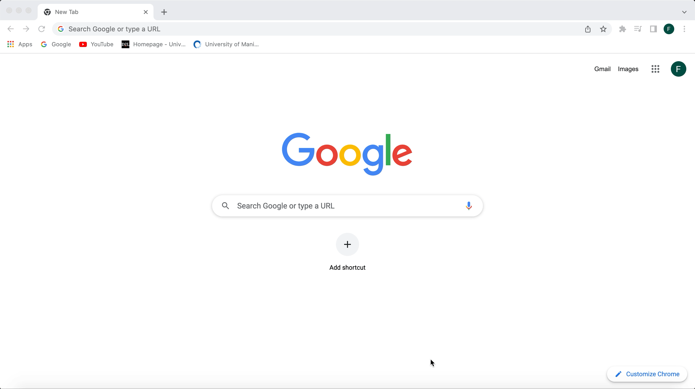

# Hosting a Resume on GitHub Pages



## Purpose

This README is meant to explain how to host and format a resume on GitHub Pages. It will also explain key principles from the book Modern Technical Writing by Andrew Etter about lightweight markup languages, distributed version control, and static websites.

## Prerequisites

Before we start, there are a few things you'll want to prepare. The first is a Markdown editor to write your resume in, such as Visual Studio Code. You will also want Git on your machine, a working knowledge of Markdown syntax, and a static site generator such as Jekyll.

### Why Markdown?

Markdown is a lightweight markup language, which means it has *lightweight* syntax, aka clean and simple syntax. Markdown especially is the cleanest and one of the most widely used lightweight markup languages in the world.

Those traits make Markdown ideal because
- It's readable even when it isn't rendered
- It's easy to learn
- It doesn’t require specific tag knowledge like HTML
- It's easy to include links and pictures

In fact, you can view an example of Markdown's simple syntax by clicking on this file and then on the **Raw Text** option.

### Why Visual Studio Code?

Visual Studio Code, or VSCode, is a versatile IDE that uses a Distributed Version Control system along with GitHub. A Distributed Version Control system is a system that allows users to download a local copy of the project onto their machine, then commit changes locally.

### Static Websites

Finally, you will need a static site generator. A static site generator takes a Markdown file and a theme and generates a static website for you. Hosting your content on a static site will let your content stay in sync instead of having to send out new documents each time you make a change, and also lets you view those changes instantly even when you're offline.

If you don't have these prerequisites prepared, you can go to [Resources](#resources) to find links and tutorials in order to get started.

## Instructions

The below instructions are for MacOS. If you are working on a different operating system, check [Resources](#resources) to find a link to instructions on how to install the various software.

### Table of Contents
- [A. Installing Jekyll](#a-installing-jekyll)
- [B. Creating a website](#)
- [C. Creating a GitHub repository]()
- [D. Hosting your resume on GitHub](#d-host-on-github-pages)

### A. Installing Jekyll
1. Install Homebrew

In order to install Jekyll, you will have to install Ruby. Homebrew is a development tool installer that makes that easy to do for Mac. Open up Terminal and copy paste this command into it:

```
/bin/bash -c "$(curl -fsSL https://raw.githubusercontent.com/Homebrew/install/HEAD/install.sh)"
```

2. Install ruby

Now install chruby, the simplest version of ruby, with the commands `brew install chruby ruby-install xz` and `ruby-install ruby 3.1.3`.

3. Configure your shell to use chruby

Use the following three commands (copy paste them separately) so your command line will automatically use chruby.
```
echo "source $(brew --prefix)/opt/chruby/share/chruby/chruby.sh" >> ~/.zshrc
echo "source $(brew --prefix)/opt/chruby/share/chruby/auto.sh" >> ~/.zshrc
echo "chruby ruby-3.1.3" >> ~/.zshrc # run 'chruby' to see actual version
```

4. Check that ruby is working

Quit Terminal and reopen it, then make sure ruby is working by entering the command `ruby -v`. You should see **ruby 3.1.3p185 (2022-11-24 revision 1a6b16756e)** or a newer version.

5. Install Jekyll

Install the latest Jekyll gem with the command `gem install jekyll` and the bundles with `gem install jekyll bundler` and `bundle update github-pages`.

### B. Creating a website

1. Create a site

Navigate to the directory you want your files to be in using `cd` commands. Then create a new Jekyll site with the command `jekyll new websiteName`.

> Note: If you've already created a repository and want to add Jekyll files to it, navigate inside of that directory and use the command 'jekyll new . --force'.

2. Add your resume to the site

Open up your new project in Visual Studio Code. Then copy paste your Markdown resume into your **index.markdown** or **index.md** file.

3. Test your site

You can test the local version of your site with the command `bundle exec jekyll serve`.

> What's the difference between `bundle exec jekyll serve` and `jekyll serve`? `bundle exec` checks for dependencies.

### C. Creating a GitHub repository

1. Create a repository

On GitHub, create a new repository titled **username.github.io**.

2. Add your files to the repository.

Use the Upload File option to add your files to the repository.

### D. Host on GitHub pages

1. Configure the settings

Go to Settings > Pages > Build and Deployment and choose Deploy from a branch. Then change the branch it's being deployed from to main.

2. View your website

Go to **username.github.io** and you should see your resume.

## Resources

- Learn Markdown [here](https://www.markdowntutorial.com/).

- Download Visual Studio Code [here](https://code.visualstudio.com/download).

- Download Git [here](https://git-scm.com/downloads).

- Buy Modern Technical Writing by Andrew Etter [here](https://www.amazon.ca/Modern-Technical-Writing-Introduction-Documentation-ebook/dp/B01A2QL9SS).

- Install Jekyll for other systems [here](https://jekyllrb.com/docs/installation).

## Authors and Acknowledgements

Credit to the template author poole for the template hyde used in this project.

Thank you to my group members Hamdi Elzard, Dirk Page, and Dane Wanke for their help and feedback in the creation of this page.

## FAQ

### **1. Why would I use Markdown over a WYSIWYG editor such as Google Docs?**

Some reasons to use Markdown over another text editor include:

- It can be used for anything
- It’s portable (you can move to any platform easily)
- It’s platform independent
- It’s future proof (even if your application stops working, you can still read Markdown)
- It’s used everywhere and many things support it
- It's easily exported to other file types such as PDF

These are also reasons why people use Markdown outside of code related projects, like note-taking.

### **2. Why are my changes not showing up after a commit?**

It can take up to 10 minutes for changes in your site to publish. If it takes longer than an hour, there may be something wrong. Check [About Jekyll build errors for GitHub Pages sites](https://docs.github.com/en/pages/setting-up-a-github-pages-site-with-jekyll/about-jekyll-build-errors-for-github-pages-sites) for more information.